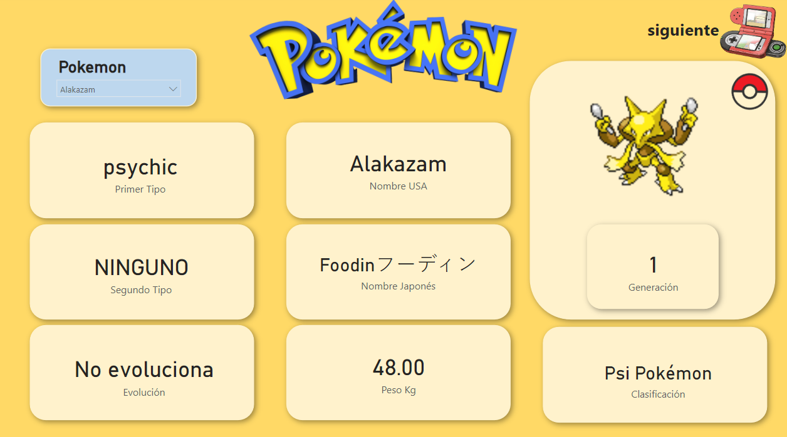
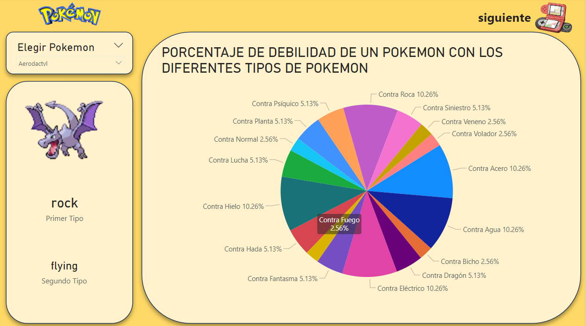

# Análisis Exploratorio de Pokémon

# Objetivo

Este proyecto tiene como objetivo facilitar la consulta de información sobre Pokémon de manera sencilla y visual. Proporciona una herramienta interactiva donde los usuarios pueden conocer detalles clave, como el nombre, la generación, el tipo y las imágenes asociadas a cada Pokémon. El análisis exploratorio se ha realizado con el fin de ofrecer una experiencia amigable para aquellos que pueden no estar familiarizados con la extensa variedad de Pokémon.

 

# Contenido del Repositorio

- **1. Carga y Limpieza de Datos:** [Pokemon ETL](etl/Pokemon_ETL.ipynb)
   - Cargamos el dataset inicial.
   - Realizamos limpieza y preprocesamiento de datos.
   - Creamos diccionario de evolución.
   - Completamos información faltante desde [Pokémon Official Site](https://www.pokemon.com/es/pokedex).

- **2. Descarga de Imágenes y Creación de Dataset de Imágenes:** [Extracción de Imágenes](etl/extracción_Imagenes_pokemon.ipynb)
   - Usamos la Pokémon API para obtener URLs de imágenes.
   - Descargamos y guardamos las imágenes localmente.

- **3. Análisis Exploratorio en Power BI:** Archivo Power BI (`analisis_pokemon.pbix`)
   - Visualizaciones interactivas con estadísticas detalladas.
   - Integración de imágenes de Pokémon.

# Tecnologías Usadas
- Lenguaje de Programación: Python
- Librerías Principales: Pandas, NumPy, Matplotlib, Seaborn
- Herramientas de Colaboración: Google Colab
- Herramienta de Visualización: Power BI
- Alojamiento: GitHub 

# Capturas de Pantalla 

 
 

# Cómo Ejecutar el Análisis

1. Descarga o clona este repositorio.
2. Abre el archivo Jupyter Notebook `Pokemon_ETL.ipynb` para ver el análisis en detalle.
3. Ruta del Dashboard Power BI Pokémon [aquí](dashboard/analisis_pokemon.pbix)
   se puede descargar el archivo ya que github no se logra visualizar :).

# Datos y Fuentes

- **Dataset Principal:** [Kaggle](https://www.kaggle.com/datasets/rounakbanik/pokemon)
- **Pokedex Oficial:** [Diccionario de Evoluciones, Géneros y Tipos](https://www.pokemon.com/es/pokedex)
- **Imagénes Pokemon:** [PokemonAPI](https://pokeapi.co/docs/v2)

---

**¡Espero que disfrutes explorando el fascinante mundo de los Pokémon!**
